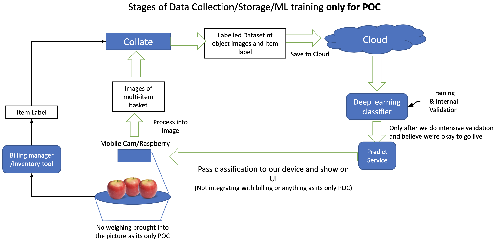

# Grocery objects detection and classification



### Setting up the Environment
0. Create conda environment.
```bash
conda create -n tensorflow pip python=3.9 # call it tensorflow
conda activate tensorflow # activate it.
```
1. Install tensorflow
```bash
pip install --ignore-installed --upgrade tensorflow==2.5.0
# test installation
python -c "import tensorflow as tf;print(tf.reduce_sum(tf.random.normal([1000, 1000])))"
```
2. Clone the official TF detection models.
```bash
git clone https://github.com/tensorflow/models.git
```
3. Install protobuf for tf.
```bash
cd models/research
protoc object_detection/protos/*.proto --python_out=.
```
4. Build Python Cocoapi tools and import into research directory.
```bash
git clone https://github.com/cocodataset/cocoapi.git
cd cocoapi/PythonAPI
make
cp -r pycocotools ../../ # models/research
```
5. Install Object Detection API
```bash
cd ../../ # models/research
cp object_detection/packages/tf2/setup.py .
python -m pip install --use-feature=2020-resolver .
```
6. Run tests to confirm proper installation.
```bash
python object_detection/builders/model_builder_tf2_test.py
```

### Creating folder structure for custom dataset training.

Use the training_demo