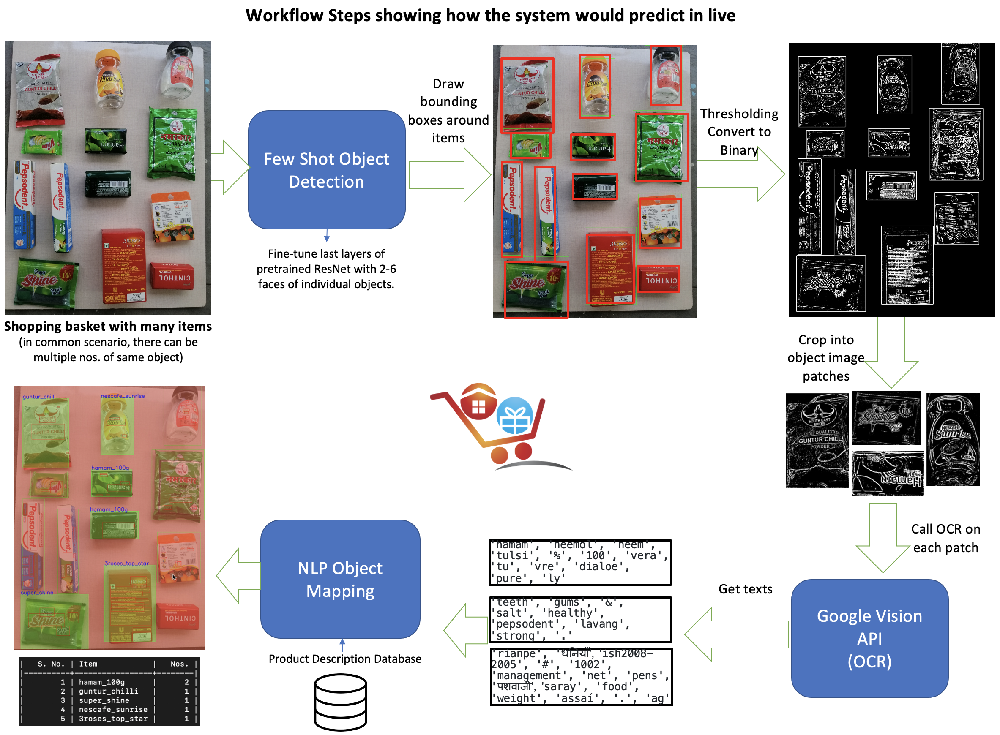

# Non Fruit Vegetable Item Detection



### Prepare your environment
Create new virtual python environment.
```bash
python -m venv grocery_env # venv command
source grocery_env/bin/activate # activate it.
```
Install requisite packages.
```bash
cd non_fnv
pip install -r requirements.txt
```
**Note:** These commands install CPU version of the PyTorch to run on a non-GPU laptop

### Training the few-shot detector for new grocery datasets

1. Download the latest `grocery-db` directory from https://drive.google.com/drive/folders/1vSFn2rv0ZtOO6SX3ps-SxG7jQSshSEn_?usp=sharing

For now, since the `grocery-db` is not in the right format, only utilize the data coming alongwith this repo.

2. Ensure that `base_dir` inside `fsdet/data/meta_grocery.py` is pointing to the correct `grocery-db` root.

3. Update meta information of `thing_classes` inside `fsdet/data/builtin_meta.py`. Check function `_get_grocery_fewshot_instances_meta()`. It should be list of all the classes present in the new training dataset. This step maybe automated to read from the directory names inside `grocery-db`.

4. Evaluator function for the GroceryDataset is present inside `fsdet/evaluation/grocery_evaluation.py`. It carries steps to compute Average Precision metrics which get printed during training on the val set. Its under work, for now simply returns constant values.

This evaluator is added to `tools/train_net.py`
```python
if evaluator_type == 'grocery_dataset':
    return GroceryDatasetEvaluator(dataset_name)
```

5. The `register_grocery()` inside `fsdet/data/builtin.py` takes care of providing the framework with all required dataset classes info and the dataset loader function to use for getting the instances.

6. **Training the model**

Lets set the config. Navigate to `non_fnv/configs/Grocery-detection/faster_rcnn_R101_FPN_ft_all.yaml`.

Few changes to be made.
- `WEIGHTS` is pointing to `checkpoints/grocery/faster_rcnn/faster_rcnn_R_101_FPN_cosine_11classes/model_0001499.pth`. This is the latest checkpoint file that came as result of fine-tuning the pre-trained ResNet101 model on the 11-item grocery dataset. Since Github has file size limit, download this file from our Gdrive grocery-db folder into the exact local directory path.
- `NUM_CLASSES` argument needs to be the length of `thing_classes`.
- `OUTPUT_LAYER` is set to `CosineSimOutputLayers` by default, so it uses cosine similarity as last layer to train few shot detector.
- `MAX_ITER` arg controls the number of epochs this will be trained. We gotta just ensure the final loss drops below 0.09 for regression and classification.
- `CHECKPOINT_PERIOD` will save in that many number of steps.
- `OUTPUT_DIR` will hold the checkpoint of trained model.

Run below command to use this config file and start training.
```bash
# train
python -m tools.train_net \
    --config-file configs/Grocery-detection/faster_rcnn_R101_FPN_ft_all.yaml \
    --opts MODEL.DEVICE cpu
```
Once the train epochs are run, inspect the logs to see if loss has dropped below 0.09 on training set. If yes, we are good with the obtained model. If not, then edit `MAX_ITER` inside the config file `configs/Grocery-detection/faster_rcnn_R101_FPN_ft_all.yaml` to previous_value+ new number of iters to train. And change the `WEIGHTS` to now load the last saved checkpoint from the `OUTPUT_DIR` and start from there.

**Important Note:** Except steps 1 to 3 and 6, no other changes required to initiate training on new dataset.

**Reference**: Instructions in the original repo about Custom Retraining of model.
https://github.com/ucbdrive/few-shot-object-detection/blob/master/docs/CUSTOM.md


## Testing the few-shot trained model [OR to Directly try out current model]
The predict script `few_shot_detection.py` is best to try out the brand new model! Just change `image_file` inside `main()` and see if the boxing happens. Ensure that `config_file` is set right.

**Note:**If you are directly coming to the testing part without really training anything, just ensure you download the latest checkpoint `.pth` file from https://drive.google.com/drive/folders/1vSFn2rv0ZtOO6SX3ps-SxG7jQSshSEn_?usp=sharing and place inside `checkpoints/grocery/faster_rcnn/faster_rcnn_R_101_FPN_ft_normalized_all1_1shot_randnovel`.

## Remaining steps
The major scripts of interest after this point.
- `vision_utils.py` -> Google OCR Vision API gets called. Get your `retailzz-4d18b61af484.json` auth key and change the Google `from_service_account_file` to read from here.
- `cv2_utils.py` -> Basic cv2 utilities to read, resize, and transform image.
- `nlp.py` -> Contains logics to handle OCR texts matching with the product descriptions.

### NLP logic
It generates two kinds of scores. First for entire product description text, and second against the similar keywords match.
1. If softmax activated entire text match is more than 98% confidence, then emit that product id. This is probably because the back side wrapper with more amount of text was placed and registered lot of hits, hence crossed this high threshold.
2. If this doesnt yield any match, then check for keywords. More the keyword list match for a specific product, higher score it gets.
3. If both the above steps dont offer a potential hit, `None` will be returned. Its better to say 'I dont know' than telling its something with less probability :sweat_smile: .

The `main.py` is the entry point into the detection system. It can be directly tried to execute the overall flow and produce final output.

For a **step-by-step** interactive execution, see `fewshot_demo.ipynb` and `fewshot_demo_other_image.ipynb`.